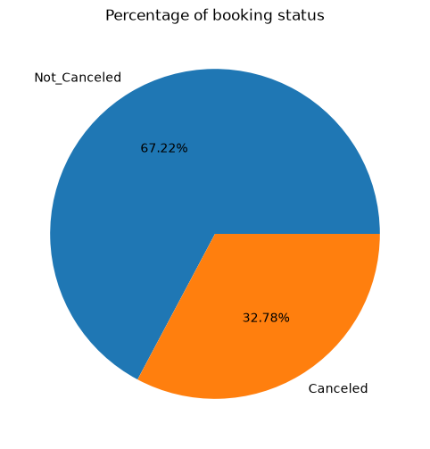
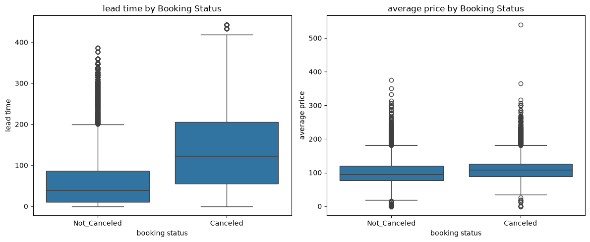
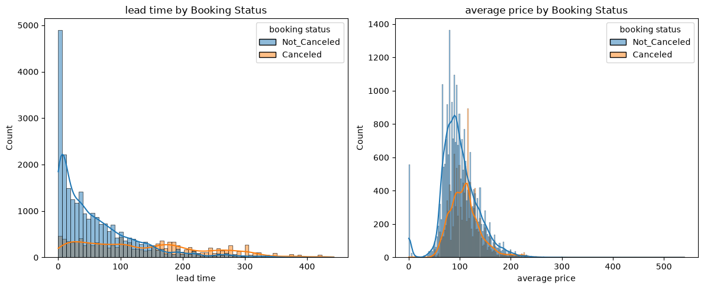
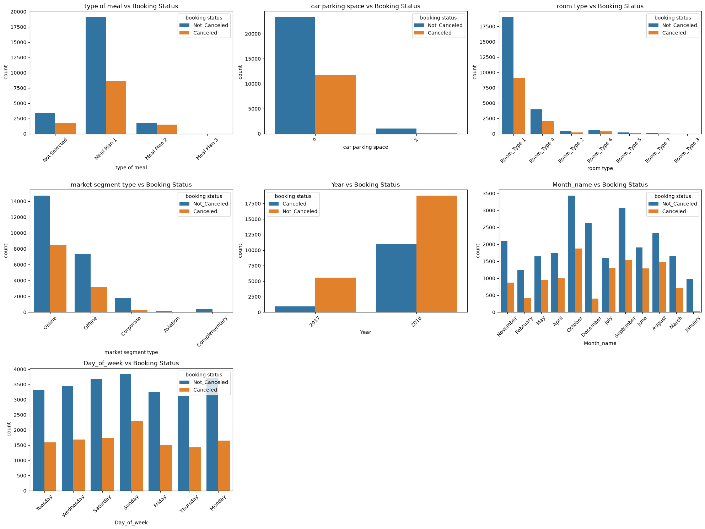
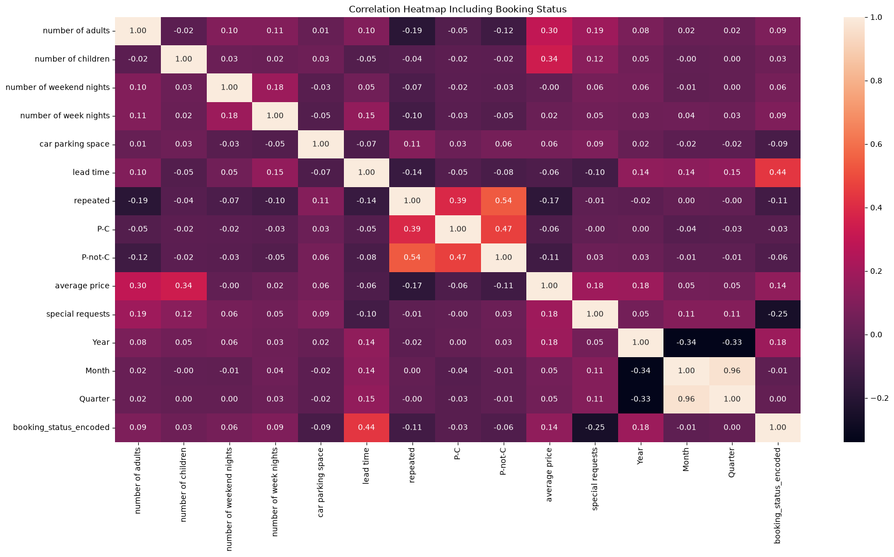
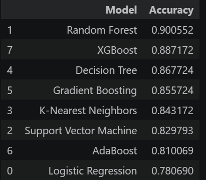
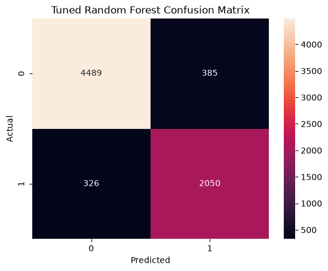
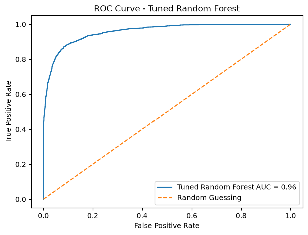
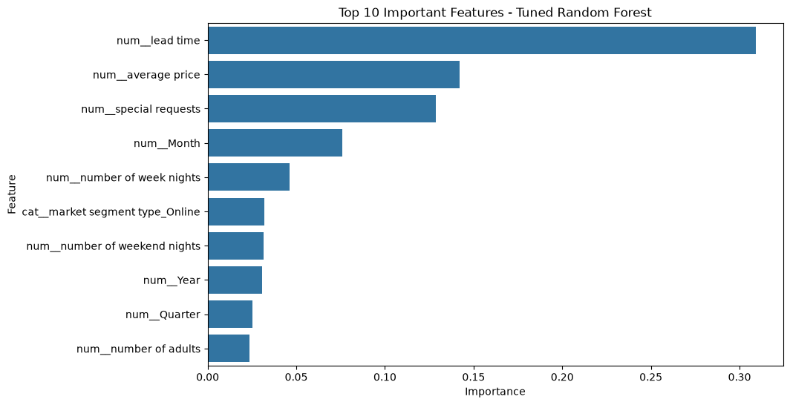

# Hotel Haven Booking Cancellation Prediction

## Project Overview

Hotel Haven is a machine learning classification project that predicts whether a hotel reservation will be **cancelled** or **not cancelled**.

Booking cancellations affect room allocation, staffing, revenue forecasting, pricing decisions, and overall hotel operations. This project uses historical reservation data to identify cancellation patterns, compare several classification algorithms, and build a model that can help hotel managers detect high-risk bookings before arrival.

---

## Business Problem

Hotels often make operational and revenue decisions based on confirmed reservations. When a customer cancels, the hotel may be left with an unsold room, inaccurate occupancy forecasts, and inefficient resource allocation.

The main business question is:

> Can historical booking information be used to predict whether a reservation is likely to be cancelled?

A reliable cancellation-risk model can help Hotel Haven improve planning, target customer communication, and make more informed revenue-management decisions.

---

## Project Objectives

- Explore booking patterns associated with cancellations.
- Clean and prepare the dataset for analysis and modelling.
- Engineer useful date-related features.
- Train and compare multiple classification models.
- Tune the best-performing model.
- Evaluate the final model using accuracy, precision, recall, F1-score, ROC-AUC, and a confusion matrix.
- Translate model findings into practical business recommendations.

---

## Dataset

The dataset contains historical hotel reservation records with information such as:

- Number of adults and children
- Weekend and weekday nights
- Meal plan
- Room type
- Car-parking-space request
- Lead time
- Arrival date
- Market segment
- Repeated-guest status
- Previous cancellations and completed bookings
- Average room price
- Number of special requests
- Booking status

### Target Variable

`booking_status`

- `Cancelled`
- `Not_Cancelled`

The `Booking_ID` column was removed because it is a unique identifier and does not provide useful predictive information.

---

## Project Workflow

1. Business and data understanding
2. Data cleaning
3. Exploratory data analysis
4. Feature engineering
5. Data preprocessing
6. Model training
7. Model comparison
8. Random Forest tuning
9. Final model evaluation
10. Business recommendations

---

## Data Preparation and Feature Engineering

The preparation process included:

- Inspecting data types and dataset structure
- Checking missing values and duplicate records
- Removing the booking identifier
- Encoding the target variable
- Separating numerical and categorical features
- Creating date-related features:
  - `Year`
  - `Month`
  - `Quarter`
  - `Day_of_week`
- Splitting the data into training and testing sets
- Applying `OneHotEncoder` to categorical variables
- Applying `StandardScaler` to numerical variables where required
- Combining preprocessing steps with Scikit-learn pipelines and `ColumnTransformer`

---

## Exploratory Data Analysis

### Booking Status Distribution

Approximately **32.78%** of reservations were cancelled, while **67.22%** were not cancelled. This represents a moderate class imbalance that should be considered during model evaluation.



### Numerical Features

Cancelled reservations generally had noticeably longer lead times. Average room price also differed between cancelled and completed bookings, although the separation was smaller than for lead time.





### Categorical and Time-Based Patterns

Booking status was examined across meal plans, parking-space requests, room types, market segments, years, months, and days of the week.



### Correlation Analysis

Among the numerical variables, `lead time` had the strongest positive relationship with the encoded booking status. `special requests` had a negative relationship with cancellation, suggesting that customers making more requests may be more committed to their reservations.



> Correlation and feature importance describe associations in this dataset; they do not prove causation.

---

## Machine Learning Models

The following models were trained and compared:

- Logistic Regression
- Support Vector Machine
- K-Nearest Neighbors
- Decision Tree
- Random Forest
- Gradient Boosting
- AdaBoost
- XGBoost

---

## Model Comparison

| Rank | Model | Accuracy |
|---:|---|---:|
| 1 | Random Forest | 90.06% |
| 2 | XGBoost | 88.72% |
| 3 | Decision Tree | 86.77% |
| 4 | Gradient Boosting | 85.57% |
| 5 | K-Nearest Neighbors | 84.32% |
| 6 | Support Vector Machine | 82.98% |
| 7 | AdaBoost | 81.01% |
| 8 | Logistic Regression | 78.07% |



Random Forest achieved the highest baseline accuracy and was selected for further tuning.

---

## Final Model: Tuned Random Forest

The tuned Random Forest produced the following test results:

| Metric | Result |
|---|---:|
| Accuracy | 90.19% |
| Precision | 84.19% |
| Recall | 86.28% |
| F1-Score | 85.22% |
| ROC-AUC | 0.96 |

The tuned model achieved only a small improvement in accuracy over the original Random Forest, but it maintained strong cancellation detection and excellent class-separation ability.

### Confusion Matrix

|  | Predicted Not Cancelled | Predicted Cancelled |
|---|---:|---:|
| **Actual Not Cancelled** | 4,489 | 385 |
| **Actual Cancelled** | 326 | 2,050 |

The model correctly identified **2,050 of 2,376 actual cancellations**, giving a cancellation recall of **86.28%**. It missed 326 cancellations and incorrectly flagged 385 completed bookings as cancellations.



### ROC Curve

The tuned Random Forest achieved an ROC-AUC score of **0.96**, indicating excellent ability to distinguish cancelled bookings from non-cancelled bookings across different classification thresholds.



---

## Feature Importance

The most influential features in the tuned Random Forest were:

1. Lead time
2. Average room price
3. Number of special requests
4. Month
5. Number of weekday nights
6. Online market segment
7. Number of weekend nights
8. Year
9. Quarter
10. Number of adults

Lead time was the dominant predictor, contributing substantially more importance than any other individual feature.



Feature importance shows how much the model used each variable when making predictions. It does not mean that changing a feature will directly cause a booking to be cancelled.

---

## Key Findings

- About one-third of the reservations in the dataset were cancelled.
- Longer lead times were strongly associated with cancellation risk.
- Lead time was the most important feature in the final model.
- Average room price and special requests were also influential.
- Customers with more special requests appeared less likely to cancel.
- Online market-segment bookings contributed meaningfully to the prediction.
- The tuned Random Forest correctly detected most actual cancellations.
- XGBoost was the second-best model by accuracy, but Random Forest remained the strongest overall performer in this comparison.

---

## Business Recommendations

### 1. Introduce Risk-Based Booking Monitoring

Use predicted cancellation probabilities to flag high-risk reservations for closer monitoring instead of treating every reservation the same.

### 2. Contact Long-Lead-Time Customers

Send confirmation reminders to customers who booked far in advance, since lead time was the strongest cancellation predictor.

### 3. Use Targeted Retention Offers

Offer date changes, booking credits, or carefully selected incentives to high-risk customers when retaining the reservation is financially worthwhile.

### 4. Improve Occupancy and Revenue Forecasts

Incorporate predicted cancellation probabilities into expected occupancy and revenue calculations rather than relying only on confirmed reservation counts.

### 5. Review Deposit and Cancellation Policies

Evaluate whether high-risk booking groups should have different deposit, confirmation, or cancellation-policy requirements.

### 6. Use Overbooking Carefully

Cancellation predictions can support overbooking decisions, but the hotel should also consider the cost of relocating guests when fewer cancellations occur than expected.

### 7. Monitor the Model

Track prediction quality over time because booking behaviour, pricing, seasonality, and customer patterns can change.

---

## Project Structure

```text
Hotel-Haven/
│
├── assets/
│   ├── booking_status_distribution.png
│   ├── categorical_features_by_booking_status.png
│   ├── correlation_heatmap_with_booking_status.png
│   ├── lead_time_average_price_boxplots.png
│   ├── lead_time_average_price_distributions.png
│   ├── model_accuracy_comparison.png
│   ├── tuned_random_forest_confusion_matrix.png
│   ├── tuned_random_forest_feature_importance.png
│   └── tuned_random_forest_roc_curve.png
│
├── data/
│   └── hotel_booking.csv
│
├── notebook/
│   └── hotel_haven_booking.ipynb
│
├── .gitignore
├── README.md
└── requirements.txt
```

Update the data and notebook filenames above to match the exact names used in the repository.

---

## Technologies Used

- Python
- pandas
- NumPy
- Matplotlib
- Seaborn
- Scikit-learn
- XGBoost
- Jupyter Notebook
- Visual Studio Code
- Git
- GitHub

---

## How to Run the Project

1. Clone the repository.

```bash
git clone <repository-url>
```

2. Open the project folder.

```bash
cd Hotel-Haven
```

3. Create a virtual environment.

```bash
python -m venv .venv
```

4. Activate the environment on Windows.

```bash
.venv\Scripts\activate
```

5. Install the required libraries.

```bash
pip install -r requirements.txt
```

6. Open and run the notebook from the first cell to the last.

```text
notebook/hotel_haven_booking.ipynb
```

---

## Limitations

- The project uses historical data from a limited period.
- External factors such as local events, weather, competitor pricing, travel disruption, and economic conditions were not included.
- Accuracy alone does not measure the financial effect of prediction errors.
- Feature importance does not establish a causal relationship.
- Performance may change when the model is used with bookings from another hotel or a later period.
- The classification threshold may need adjustment based on the relative cost of missed cancellations and false alerts.

---

## Future Improvements

- Use cross-validation during model selection and tuning
- Compare precision-recall curves
- Optimise the classification threshold using business costs
- Add SHAP explanations for individual predictions
- Build a Streamlit or FastAPI application
- Save the complete preprocessing and prediction pipeline
- Add model monitoring and scheduled retraining
- Include external seasonal, event, and pricing data

---

## Conclusion

The Hotel Haven project demonstrates how machine learning can help hotels predict reservation cancellations and improve operational planning.

Among eight classification algorithms, Random Forest achieved the highest baseline accuracy. After tuning, the final model reached **90.19% accuracy**, **86.28% recall**, an **85.22% F1-score**, and **0.96 ROC-AUC**.

The model’s strongest predictors—especially lead time, average room price, and special requests—provide useful signals for identifying high-risk reservations. With appropriate monitoring and business rules, the model could support more accurate occupancy forecasting, better customer communication, and reduced revenue loss.

---

## Author

**Sofiyah Oladele**  
**Data Scientist, Machine Learning & AI**

- GitHub: [Oladelesofiyah](https://github.com/Oladelesofiyah)
- LinkedIn: [Sofiyah Oladele](https://www.linkedin.com/in/sofiyaholadele)
